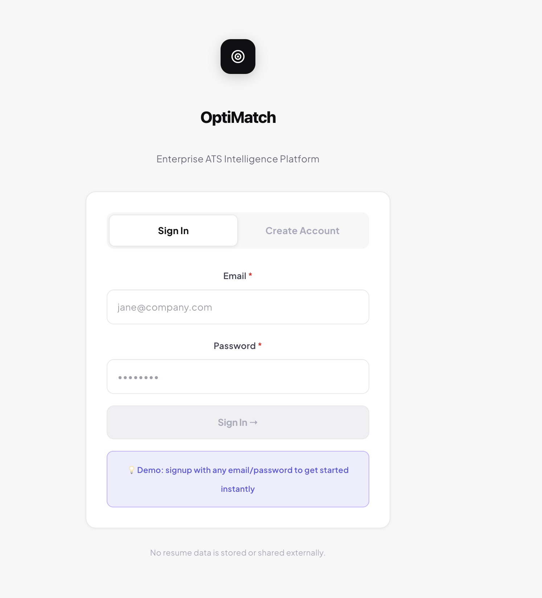
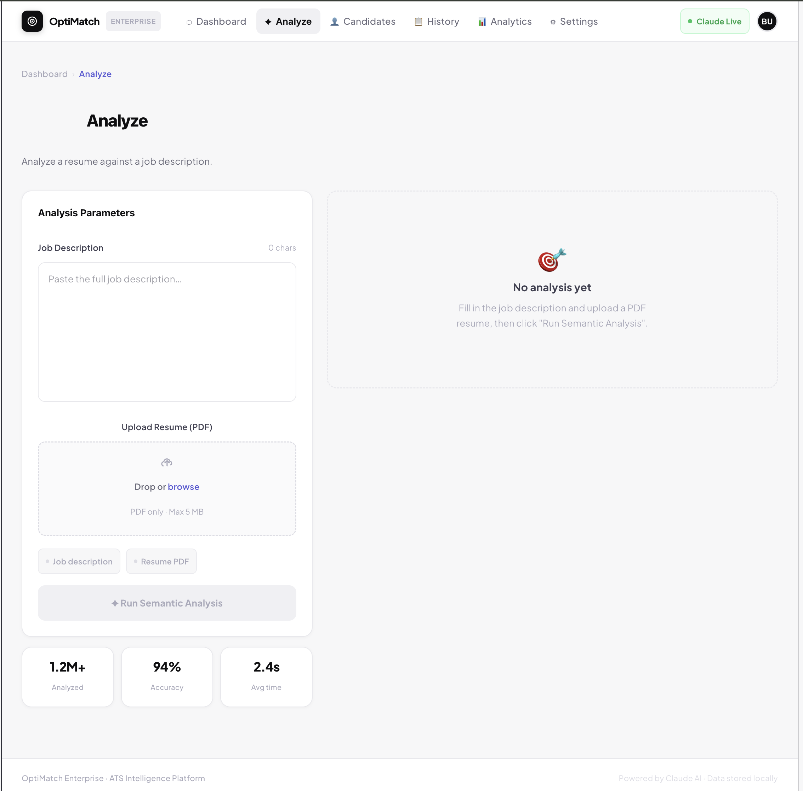
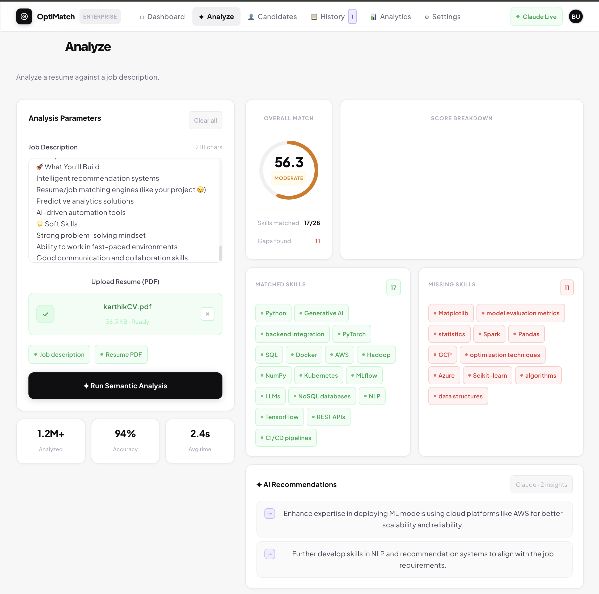

<div align="center">

# ResumeIQ — ATS Analyzer

### AI-Powered Resume Analysis & Job-Fit Matching

[](https://www.python.org/)
[](https://fastapi.tiangolo.com/)
[](https://react.dev/)
[](https://openai.com/)

**Upload a resume. Add a job description. Understand your fit before you apply.**

[Overview](#-overview) · [Features](#-features) · [Architecture](#-how-it-works) · [Setup](#-getting-started) · [Project Structure](#-project-structure)

</div>

---

## 🎯 Overview

**ResumeIQ** is an AI-powered resume analysis application that compares a candidate's resume with a target job description and turns the comparison into an actionable job-fit report.

Instead of relying only on keyword matching, the system combines document parsing, NLP/semantic analysis, structured scoring, and LLM-generated feedback to surface:

- Overall ATS-style compatibility
- Relevant and missing skills
- Resume strengths and weaknesses
- Job-specific improvement suggestions
- A visual breakdown that is easy to understand

> **Note:** ATS scores are estimates intended to help candidates improve their applications. They do not represent the scoring system of any particular employer or ATS vendor.

---

## ✨ Features

| Capability | What it does |
|---|---|
| 📄 **Resume PDF Analysis** | Extracts useful information from uploaded resumes |
| 🎯 **Job-Fit Scoring** | Produces a 0–100 compatibility estimate |
| 🔍 **Skill Gap Analysis** | Highlights matching and missing skills |
| 🧠 **AI-Powered Insights** | Generates contextual recommendations using an LLM |
| 📊 **Visual Dashboard** | Presents scores and recommendations in an intuitive interface |
| ⚡ **API-Based Architecture** | Separates the frontend experience from backend processing |
| 🔐 **Environment-Based Secrets** | Keeps API credentials outside the source code |

---

## 🖼️ Application Preview

### Login



### Resume Analysis



### Results Dashboard



---

## 🧠 How It Works

```text
                ┌──────────────────────┐
                │   Resume PDF Upload  │
                └──────────┬───────────┘
                           │
                           ▼
                ┌──────────────────────┐
                │   Text Extraction    │
                └──────────┬───────────┘
                           │
                           ▼
                ┌──────────────────────┐
                │   NLP / Processing   │
                └──────────┬───────────┘
                           │
        ┌──────────────────┴──────────────────┐
        │                                     │
        ▼                                     ▼
┌──────────────────┐                 ┌──────────────────┐
│ Resume Features  │                 │ Job Description  │
└────────┬─────────┘                 └────────┬─────────┘
         │                                    │
         └────────────────┬───────────────────┘
                          ▼
                ┌──────────────────────┐
                │ Semantic Comparison  │
                └──────────┬───────────┘
                           ▼
                ┌──────────────────────┐
                │ ATS / Fit Scoring    │
                └──────────┬───────────┘
                           ▼
                ┌──────────────────────┐
                │ AI Recommendations   │
                └──────────┬───────────┘
                           ▼
                ┌──────────────────────┐
                │ Results Dashboard     │
                └──────────────────────┘
```

### Processing flow

1. **Upload** a resume in PDF format.
2. **Extract** and preprocess the resume content.
3. **Process** resume and job-description text using NLP techniques.
4. **Compare** relevant skills, experience, and semantic content.
5. **Score** the candidate-job match.
6. **Generate insights** highlighting gaps and improvement opportunities.
7. **Visualize** the results through the React interface.

---

## 🏗️ Architecture

```text
┌─────────────────────────────────────────────┐
│                React Frontend               │
│        Upload • Dashboard • Results         │
└──────────────────────┬──────────────────────┘
                       │ HTTP / REST
                       ▼
┌─────────────────────────────────────────────┐
│                 FastAPI Backend             │
│      API • Validation • Processing Logic     │
└───────────────┬─────────────────────────────┘
                │
       ┌────────┼───────────────┐
       ▼        ▼               ▼
   Resume      NLP /         LLM Layer
   Parser    Similarity       Insights
       │        │               │
       └────────┼───────────────┘
                ▼
        Persistence / Data

```

### Core layers

**Frontend**
- React
- Vite
- Tailwind CSS
- Interactive analysis and results views

**Backend**
- FastAPI
- Python
- REST API endpoints
- Resume-processing pipeline

**AI / NLP**
- Semantic similarity and NLP processing
- LLM-assisted recommendations
- Skill and job-fit analysis

**Data**
- SQLite for local development
- ChromaDB/vector data used by the analysis pipeline where applicable

---

## 🛠️ Tech Stack

| Layer | Technologies |
|---|---|
| Frontend | React, Vite, Tailwind CSS |
| Backend | Python, FastAPI, Uvicorn |
| AI / NLP | OpenAI, semantic analysis, NLP processing |
| Data | SQLite, ChromaDB |
| Migrations | Alembic |
| Package Management | pip, npm |
| Development | Git, REST APIs |

---

## 🚀 Getting Started

### Prerequisites

Make sure you have:

- **Python 3.10+**
- **Node.js 18+**
- **npm**
- An **OpenAI API key**

### 1. Clone the repository

```bash
git clone https://github.com/nkpraneethreddy/ResumeIQ-ATS-Analyzer.git
cd ResumeIQ-ATS-Analyzer
```

### 2. Configure the backend

```bash
cd backend
python -m venv .venv
```

Activate the environment:

**Windows**

```powershell
.venv\Scripts\activate
```

**macOS / Linux**

```bash
source .venv/bin/activate
```

Install dependencies:

```bash
pip install -r requirements.txt
```

### 3. Add environment variables

Create `backend/.env`:

```env
OPENAI_API_KEY=your_openai_api_key_here
```

Never commit your real API key to GitHub.

### 4. Start the backend

From the `backend` directory:

```bash
PYTHONPATH=. uvicorn src.main:app --reload
```

API:

```text
http://localhost:8000
```

Interactive API documentation:

```text
http://localhost:8000/docs
```

### 5. Start the frontend

Open another terminal:

```bash
cd frontend
npm install
npm run dev
```

The Vite development server normally runs at:

```text
http://localhost:5173
```

---

## 📁 Project Structure

```text
ResumeIQ-ATS-Analyzer/
│
├── backend/
│   ├── src/
│   │   └── main.py
│   ├── data/
│   │   ├── sample_jd/
│   │   └── sample_resumes/
│   ├── migrations/
│   ├── requirements.txt
│   └── .env
│
├── frontend/
│   ├── src/
│   ├── public/
│   ├── package.json
│   └── vite.config.js
│
├── assets/
│   ├── login.png
│   ├── analyse.png
│   └── final.png
│
└── README.md
```

---

## 📊 Example Output

A typical analysis produces a report containing:

```text
Overall Job-Fit Score
        82 / 100

Matched Skills
✓ Python
✓ FastAPI
✓ REST APIs
✓ SQL

Skill Gaps
• Docker
• Kubernetes
• CI/CD

Recommendations
→ Add measurable project outcomes
→ Highlight backend deployment experience
→ Include missing technologies where genuinely applicable
```

The recommendations are intended to help candidates make **job-specific improvements** rather than blindly stuffing keywords into a resume.

---

## 🔐 Security Notes

- Keep API keys in `.env` files or environment variables.
- Never commit secrets, tokens, or production credentials.
- Generated databases/vector stores should normally remain outside version control.
- For production deployments, use a managed database and secure secret-management solution.

---

## 🔮 Future Improvements

- [ ] Resume auto-rewriting with user approval
- [ ] DOCX resume support
- [ ] Multiple job-description comparison
- [ ] Explainable score breakdown by category
- [ ] Interview-question generation from skill gaps
- [ ] Job recommendation engine
- [ ] Recruiter analytics dashboard
- [ ] Background processing for large documents
- [ ] Production authentication and role-based access
- [ ] Automated evaluation benchmarks for matching quality

---

## 📌 Portfolio Highlights

This project demonstrates practical experience with:

- AI-assisted document analysis
- Semantic matching between unstructured documents
- LLM integration through an API
- FastAPI backend development
- React frontend development
- REST API design
- Vector-search/data workflows
- Environment and secret management
- Full-stack AI application architecture

---

## 📄 License & Attribution

This repository contains an adaptation of an existing open-source project. Review the original repository's license and preserve any required attribution when redistributing or substantially modifying the code.

---

<div align="center">

### ResumeIQ
**Understand your resume. Understand the job. Improve the match.**

</div>
